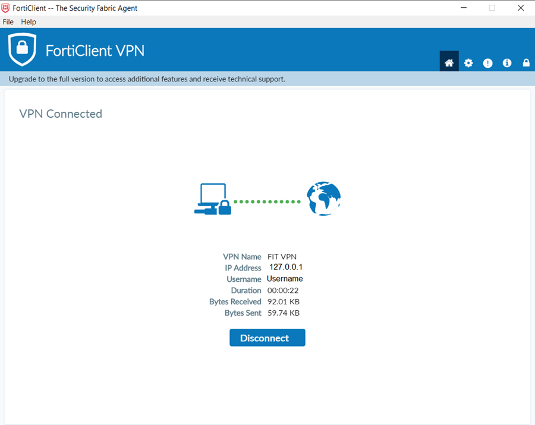

# Getting VPN
## 0. Prerequisites
FortiClient VPN requires DUO two-factor authentication. Please refer to [this KB article](https://help.fit.edu/TDClient/39/Portal/KB/ArticleDet?ID=797) to setup DUO.

## 1. Introduction
FIT asks for using VPN to remotely use some of the resources.

## 2. Get VPN software
For Windows - Click [HERE](https://tsc.fit.edu/forticlient/FortiClientVPNSetup_6.2.6.0951_x64.exe.zip)

For Mac - Click [HERE](https://tsc.fit.edu/forticlient/FortiClientVPNSetup6.2.6.737macosx.dmg.zip)

## 3. How to configure FortiClient VPN
Once the application is installed, you will need to select to add a new connection. Follow the settings in the image below.

After the connection is configured type in your TRACKS username and password and click the CONNECT button.
 
**You will receive a DUO approval request on your DUO mobile app.**  
The VPN connection status will remain at 45% until you select Approve in the mobile app.

NOTE: If the connection status stops at 40%, please look at your task bar in the bottom and check if there is a second instance of FortiClient asking you to accept a certificate, if it is, please accept the certificate. 

Once the connection has been established your application should look like the image below:

## 4. Update FortiClient connection settings
*NOTE: This step is used to change the VPN connection settings, because FIT changed the server once.* 
*NOTE 2: Normally you don't need this step, unless you want to use it for something else (not FIT).*

Click on the **three lines** to the right of your selected "VPN Name", and click **Edit The Selected Connection**.

Remove roar.fit.edu from the Remote Gateway field and enter **FITVPN.fit.edu**. Click **Save**.

